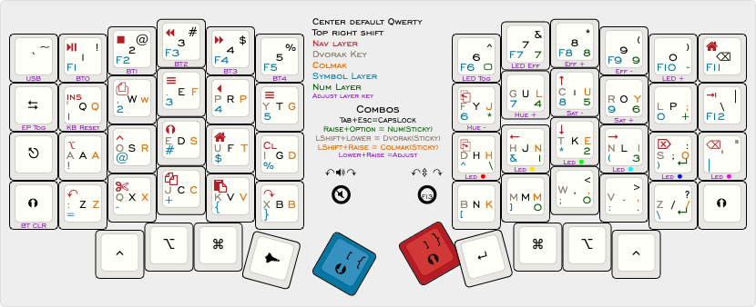

# mysofle

This is only in the planning stages right now.  This is a place for me to keep my notes until I get everything ordered get it built and tested.

## Parts
* [Sofle Kit](https://www.diykeyboards.com/parts/pcbs/product/631-) Includes most stuff including leds
* [Rotary Encoder with knobs](https://www.diykeyboards.com/parts/electronics/product/rotary-encoder-ec11)x2
* [Female Socket Pin header](https://www.diykeyboards.com/user-account/product/single-row-40pin-2-54mm-round-female-sip-socket-pin-header)x2
* [Sofle Tenting Case](https://keebd.com/products/sofle-v2-1-acrylic-tenting-case-kit?variant=41478141116568)
* [4 Pin Header socket](https://keebd.com/products/4-pin-2-54mm-header-socket?variant=42157187203224) for oled
* [Nice!nano v2.0](https://flashquark.com/product/nicenano-v2-0-wireless-pro-micro-replacement/)x2
* [Gateron Brown Switches](https://flashquark.com/product/pcb-mounted-gateron-switches-5-legs/?attribute_color=Brown)x60 (2 extra)
* [Translucent DSA Keycaps Black](https://flashquark.com/product/translucent-dsa-keycaps/?attribute_color=Translucent+Black)
* [Translucent DSA Keycaps Red](https://flashquark.com/product/translucent-dsa-keycaps/?attribute_color=Translucent+Red)
* [2000 mAH Battery](https://amzn.to/3mfwSbX)x2
* [Toggle Switches](https://amzn.to/3mfwSbX)
* [Acryplic Glass](https://amzn.to/3y4UAKK) Used to create a box to hold the battery.
* [TRRS cable](https://www.amazon.com/gp/product/B08NWFC1HN/ref=ppx_yo_dt_b_asin_title_o00_s01?ie=UTF8&psc=1) This isnt actually needed.  The havles talk to each other through bluetooth.  I hope the firmware adds a wired capability in the future.

There is some extra keycaps in there each of those is 50 keycaps. My plan is to use 40 of the black and 18 of red.  I also ordered usb-c cables and usb-c to a adapters for this setup but its not really part of the build.

## Helpful links
* [ZMK Docs](https://zmk.dev/docs)
* [ZMK Keymap Editor](https://nickcoutsos.github.io/keymap-editor/). You can also run this locally.  Just go to the git repo linked at bottom of the editor and follow instructions
* [Keyboard layout](http://www.keyboard-layout-editor.com/#/gists/c8746c4ec0a3afdd1420ac8a96ec3f03)
